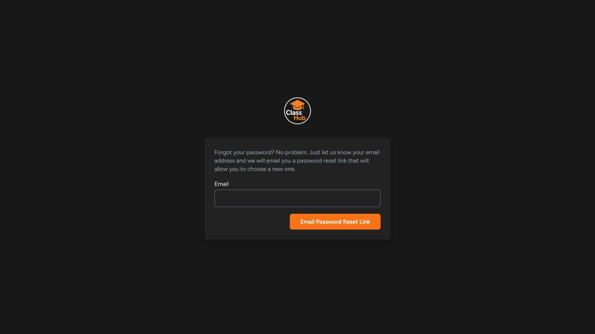

# 🎓 Web-Based LMS (Laravel + Tailwind + SQLite) — University Project

A full-featured web Learning Management System (LMS) built with **Laravel**, **Tailwind CSS**, and **SQLite**. Supports teacher/student roles, subject and task creation, solution submission and evaluation — all wrapped in a clean, responsive interface. Developed for Semester 4 university coursework.

---

## 📸 Screenshots

### 🧑‍🏫 Teacher View
- Dashboard  
  
- Create Subject  
  
- Create Task  
  
- Subjects List  
  
- Task List for a Subject  
  
- Task Grading  
  

### 👨‍🎓 Student View
- Dashboard  
  
- Take a Subject  
  
- Tasks for Subject  
  
- Submit Task Solution  
  
- View Task & Submit  
  
- View Grade  
  

### 🔐 Auth Pages
- Landing Page  
  
- Login  
  
- Signup  
  
- Forgot Password  
  

  ### 🔐 Profile
- Profile Page  
  

### 📞 Contact Page
- Contact  
  


---

## ✨ Features

- 🔐 Authentication system (Laravel Breeze)
- 👨‍🏫 Teacher functionality:
  - Create, edit, soft-delete subjects
  - Add and manage tasks
  - View submitted solutions
  - Evaluate student submissions
- 👨‍🎓 Student functionality:
  - Register and login
  - Join or leave subjects
  - View assigned tasks
  - Submit solutions
- 📊 SQLite database pre-seeded with demo users and subjects
- 🧪 Validation for all forms
- 🌈 Tailwind CSS for responsive design

---

## ⚙️ Tech Stack

- 🐘 **Laravel** — PHP backend framework
- 💅 **Tailwind CSS** — Utility-first CSS framework
- 🗄️ **SQLite** — Lightweight relational database
- 🌐 Laravel Breeze — Simple auth scaffolding
- 🧪 Laravel Migrations + Seeders for demo data

---

## 🚀 How to Run

Make sure you have PHP, Composer, Node.js, and SQLite installed.

```bash
# 📦 Backend Setup
composer install

# 🗃️ Migrate and seed database
php artisan migrate:fresh
php artisan db:seed

# 🔥 Start the development server
php artisan serve
```

The app will be accessible at `http://localhost:8000`.

---

## 🧪 Demo Credentials

**Teacher Login**
- Email: `teacher@classhub.test`
- Password: `teacher123`


**Student Login**
- Email: `student@classhub.test`
- Password: `student123`


---

## 📚 University Info

- 👨‍🎓 Student: Saeed Khanloo  
- 🧠 Course: Advanced Web Development  
- 🗓️ Semester: 4  
- 🏛️ Institution: Eötvös Loránd University (ELTE)  

---

## 🪪 License

MIT License
